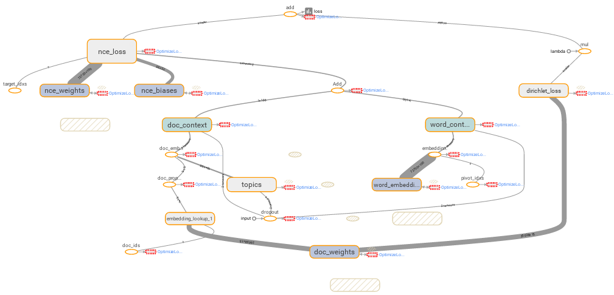

# lda2vec-tf
TensorFlow implementation of Christopher Moody's [*lda2vec*](https://github.com/cemoody/lda2vec), a hybrid of
[Latent Dirichlet Allocation](https://www.cs.princeton.edu/~blei/papers/BleiNgJordan2003.pdf) &
[*word2vec*](https://papers.nips.cc/paper/5021-distributed-representations-of-words-and-phrases-and-their-compositionality.pdf)

The *lda2vec* model simultaneously learns embeddings (continuous dense vector representations) for:
* words (based on word and document context),
* topics (in the same latent word space), and
* documents (as sparse distributions over topics).

\[ \+ integrated with the tf Embeddings Projector to interactively visualize results \]

## WIP
Check back for updated docs and a walk-through example.

Meanwhile, read the [paper](http://arxiv.org/abs/1605.02019) and
see the excellent README @ the [original](https://github.com/cemoody/lda2vec) repo.

## Requirements
* Python 3
* TensorFlow 0.12.0+
* numpy
* pandas
